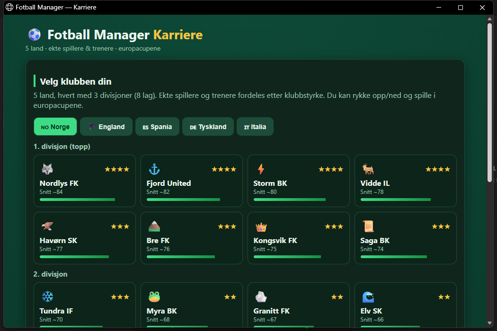

# ⚽ Fotball Manager — Karriere

En tekstbasert fotball-manager som kjører rett i nettleseren. Bygg klubben din over flere
sesonger: sett taktikk, styr økonomien, kjøp og selg spillere, og kjemp i ligaen, cupen,
europacupene og med landslaget.

## 🎮 Spill her

👉 **[denlillaapekatten.github.io/fotball-manager](https://denlillaapekatten.github.io/fotball-manager/)**

Ingen installasjon — åpne lenken på PC, mobil eller nettbrett. Fremdriften lagres automatisk
i nettleseren din (per enhet).



## ✨ Funksjoner

- **5 land** (Norge, England, Spania, Tyskland, Italia), hvert med 3 divisjoner à 8 lag og
  **opp-/nedrykk** mellom divisjonene.
- **Kalender (FIFA-stil)** — dagene går mellom kampene, og alt imellom simuleres. Liga i
  helgene, cup og europacup midtuke.
- **Energi & form** — spillerne blir slitne av å spille og henter seg inn mellom kampene.
  Lav energi senker ytelsen og øker skaderisikoen, så du må rotere troppen.
- **Overganger** med søk, posisjonsfilter, sortering og «kun råd til»-filter — pluss frie
  agenter og salg.
- **Europacupene**: Champions League, Europa League og Conference League, med kvalifisering
  basert på forrige sesongs ligaplassering på tvers av landene.
- **Cup**, **landslag** (internasjonalt mesterskap) og **ungdomsakademi** som produserer
  egne talenter.
- **Toppscorerliste**, **skader**, **kontrakter**, **styrets sesongmål** og **premiepenger**.
- **Ekte spillere og trenere** (omtrentlige ratinger) fordelt etter klubbstyrke.
  Fjord United har bl.a. Rashford, Tielemans og Tuanzebe.

## 🕹️ Slik spiller du

1. Velg land og klubb på startskjermen.
2. Sett laget ditt under **Tropp** (formasjon, mentalitet, startellever) — følg med på energi.
3. Trykk **Fortsett →** på Oversikt for å spille deg gjennom kalenderen.
4. Bygg klubben via **Overganger** og **Akademi**, og jakt trofeer i liga, cup, Europa og med landslaget.

## 💻 Kjøre lokalt

Alt ligger i én fil, så du kan bare åpne `index.html` i en nettleser.

Vil du kjøre via en lokal server (PowerShell):

```powershell
./serve.ps1 -Port 8731
# åpne deretter http://localhost:8731/
```

## 🛠️ Teknisk

- Ren HTML/CSS/JavaScript i én fil (`index.html`) — ingen avhengigheter, ingen byggesteg.
- Lagring via nettleserens `localStorage`.

> Alle klubber er fiktive. Spiller- og trenerratinger er omtrentlige og kun for moro skyld.
